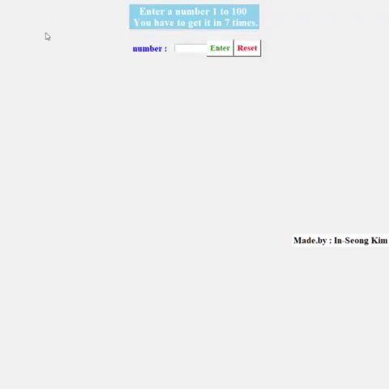
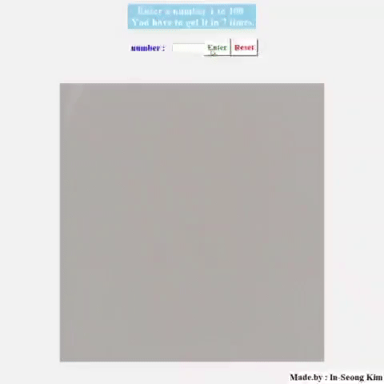

# 🎯 숫자 맞추기 게임 (Number Guess Game)

> 📅 제작일: 2021.12.29  
> 🧪 개발환경: Python + Tkinter GUI
---

## 🎮 게임 소개

`숫자 맞추기 게임`은 1부터 100 사이의 정답 숫자를 **최대 7번의 시도 안에 맞히는 게임**입니다.  
Python의 GUI 툴킷인 **Tkinter**를 활용하여 제작하였고, 직관적인 인터페이스를 제공합니다.

> 🧠 **7회 제한** 이유?  
> 최적의 전략(절반씩 줄이는 이진 탐색 방식)을 사용할 경우  
> 7회 안에 어떤 숫자든 무조건 맞출 수 있도록 설계되었습니다.

---

## 📸 게임 결과 화면

| 성공 시 이미지 (7회 이내 정답) | 실패 시 이미지 (7회 초과) |
|:-------------------------------:|:---------------------------:|
|         |        |

> 성공 이미지엔 개인적으로 좋아했던 아이유의 따봉 짤을 사용했습니다 👍

---

## 🕹️ 실제 플레이 예시 (GIF)

| 성공한 플레이 (7회 이내) | 실패한 플레이 (7회 초과) |
|:-------------------------:|:--------------------------:|
|   |       |

---

## ⚙️ 기능 설명

- ✅ 사용자가 1~100 숫자를 입력 후, `Enter` 버튼으로 정답과 비교
- 📉 결과는 `업(UP)` / `다운(DOWN)`으로 힌트 제공
- 🔁 `Reset` 버튼으로 게임 초기화 가능
- 💯 7회 안에 맞추면 `Success`, 못 맞추면 `Fail` 처리

---

## 🧰 사용 기술

| 기술 | 설명 |
|------|------|
| Python 3.x | 기본 프로그래밍 언어 |
| Tkinter | GUI 구성 및 이벤트 처리 |
| Random | 정답 숫자 생성에 사용 |

---

## 📎 관련 링크
- [Tkinter 공식 문서](https://docs.python.org/3/library/tkinter.html)

---

> 단순하지만 전략적으로 즐길 수 있는 미니게임!  
> GUI 설계와 조건문 로직을 연습하기에 좋은 Python 프로젝트입니다.
